# Üniversite Sözlü Sınav Yönetim Sistemi
## 1. Genel Bakış

Bu sistem, üniversitelerdeki sözlü sınav süreçlerini dijitalleştirmek ve yönetmek için tasarlanmış kapsamlı bir web uygulamasıdır. Öğretim üyelerinin sınav sorularını ve öğrenci listelerini yükleyebileceği, sınavlar oluşturabileceği, değerlendirme yapabileceği ve detaylı analiz raporları alabileceği entegre bir platform sunar.
## 2. Sistem Mimarisi ve Hiyerarşik Yapı

Sistem, üniversite yapısına uygun hiyerarşik bir organizasyonla tasarlanmıştır:
text

Üniversite → Fakülte → Anabilim Dalı → Bilim Dalı → Ders (Dönem’e bağlı) → Sınav

Ana Varlıklar:

    Fakülte: Tıp Fakültesi, Mühendislik Fakültesi vb.

    Anabilim Dalı: Dahili Bilimler, Cerrahi Bilimler vb.

    Bilim Dalı: Kardiyoloji, Nöroloji vb.

    Dönem: 2025-2026

    Ders: KARD-501 İleri Kardiyoloji (her dönem tekrar açılır)

    Sınav: 2025-Bahar Dönemi Sözlü Sınavı (derse özgü, dönemlik)

    Soru Havuzu: Ders kapsamındaki tüm sınav soruları

    Öğrenci Listesi: Sınava girecek öğrenciler

## 2.1. Veri Modeli ve Entity-Relationship Diyagramı

### Ana Varlık İlişkileri

```mermaid
erDiagram
    UNIVERSITY ||--o{ FACULTY : contains
    FACULTY ||--o{ MAIN_DEPARTMENT : contains
    MAIN_DEPARTMENT ||--o{ SUB_DEPARTMENT : contains
    SUB_DEPARTMENT ||--o{ COURSE : offers
    COURSE ||--o{ EXAM : has
    COURSE ||--o{ QUESTION_POOL : has
    EXAM ||--o{ EXAM_SESSION : contains
    EXAM_SESSION ||--o{ STUDENT_EVALUATION : has
    QUESTION_POOL ||--o{ QUESTION : contains
    EXAM ||--o{ EXAM_QUESTION : uses
    QUESTION ||--|| EXAM_QUESTION : referenced_by
    
    USER ||--o{ USER_ROLE : has
    USER_ROLE }o--|| FACULTY : belongs_to
    USER_ROLE }o--|| MAIN_DEPARTMENT : belongs_to
    USER_ROLE }o--|| SUB_DEPARTMENT : belongs_to
    
    STUDENT ||--o{ STUDENT_EVALUATION : receives
    USER ||--o{ STUDENT_EVALUATION : gives_as_jury
    
    UNIVERSITY {
        int id PK
        string name
        string code
        datetime created_at
    }
    
    FACULTY {
        int id PK
        int university_id FK
        string name
        string code
        datetime created_at
    }
    
    MAIN_DEPARTMENT {
        int id PK
        int faculty_id FK
        string name
        string code
        datetime created_at
    }
    
    SUB_DEPARTMENT {
        int id PK
        int main_department_id FK
        string name
        string code
        datetime created_at
    }
    
    COURSE {
        int id PK
        int sub_department_id FK
        string name
        string code
        string description
        int credit_hours
        datetime created_at
    }
    
    EXAM {
        int id PK
        int course_id FK
        string name
        string semester
        int academic_year
        enum status
        int questions_per_student
        datetime exam_date
        int duration_minutes
        datetime created_at
    }
    
    QUESTION_POOL {
        int id PK
        int course_id FK
        string name
        string description
        datetime created_at
    }
    
    QUESTION {
        int id PK
        int question_pool_id FK
        int created_by_user_id FK
        text case_description
        text main_question
        json sub_questions
        json expected_answers
        json scoring_Tam puan ve alt punalarına
        enum difficulty_level
        float initial_difficulty
        float actual_difficulty
        float success_rate
        int usage_count
        enum approval_status
        datetime created_at
        datetime last_calibrated
    }
    
    USER {
        int id PK
        string username
        string email
        string first_name
        string last_name
        string ldap_dn
        datetime last_login
        datetime created_at
    }
    
    USER_ROLE {
        int id PK
        int user_id FK
        int faculty_id FK
        int main_department_id FK
        int sub_department_id FK
        enum role_type
        boolean is_active
        datetime assigned_at
    }
    
    STUDENT {
        int id PK
        string student_number
        string first_name
        string last_name
        string email
        int faculty_id FK
        datetime created_at
    }
    
    EXAM_SESSION {
        int id PK
        int exam_id FK
        int student_id FK
        int jury_user_id FK
        datetime session_start
        datetime session_end
        enum status
        float total_score
        json question_scores
        text jury_notes
    }
    
    EXAM_QUESTION {
        int id PK
        int exam_id FK
        int question_id FK
        int assignment_order
        datetime assigned_at
    }
    
    STUDENT_EVALUATION {
        int id PK
        int exam_session_id FK
        int question_id FK
        int student_id FK
        int jury_user_id FK
        json answer_scores
        float question_total_score
        text jury_comments
        datetime evaluated_at
    }
    
    AUDIT_LOG {
        int id PK
        int user_id FK
        string action_type
        string table_name
        int record_id
        json old_values
        json new_values
        string ip_address
        datetime timestamp
    }
    
    TEST_RESULT {
        int id PK
        string test_suite
        string test_name
        enum status
        float execution_time
        text error_message
        int code_coverage
        datetime run_at
    }
    
    SYSTEM_HEALTH {
        int id PK
        string component_name
        enum status
        json metrics
        text alerts
        datetime checked_at
    }
```

### Kullanıcı Rolleri ve Yetki Matrisi

```mermaid
flowchart TB
    subgraph "Kullanıcı Rolleri"
        A[BOSS<br/>Süper Admin]
        B[FACULTY_HEAD<br/>Fakülte Sorumlusu]
        C[DEPARTMENT_HEAD<br/>Kurul Başkanı]
        D[LECTURER<br/>Hoca/Jüri]
    end

    subgraph "Öğrenci"
        E[STUDENT<br/>Öğrenci]
    end
    
    subgraph "Yetki Seviyeleri"
        A --> F[Tüm Sistem]
        B --> G[Fakülte Kapsamı]
        C --> H[Anabilim/Bilim Dalı]
        D --> I[Ders ve Sınav Kapsamı]
        E --> J[Kendi Sınav Süreci]
    end
    
    subgraph "Ana İşlemler"
        F --> K[Hiyerarşi Yönetimi<br/>Dönem Tanımlama<br/>Fakülte ve MYO tanımlama <br/>FACULTY_HEAD atama<br/> Sistem Konfigürasyonu<br/>Rol Yönetimi <br/>Diğer kullanıcılara tanımlanan işlemleri görme ve CRUD]
        G --> L[Fakülte hiyerarşi tanımlama<br/>Anabilimdalı/Bilimdalı/Ders Açma<br/>Kurul Başkanı ve Hoca Atama<br/>Derse Öğrenci ekleme<br/>Derse Sınav Planlama <br/>Soru Havuzu CRUD]
        H --> M[Soru Havuzu CRUD<br/>Soru Onay Süreçleri<br/>Derse Sınav Planlama<br/>Sınav Yürütme <br/>Jüri Atama]
        I --> N[Soru Havuzuna Soru Ekleme<br/>Kendine Atanan Sınavları Yapma]
        J --> O[Sınav Katılımı<br/>Sonuç Görüntüleme<br/>Geri Bildirim]
    end

    subgraph "Dönem Bazlı İşlemler"
        P[Yeni Dönem Başlat] --> Q{Ders Atama Yöntemi}
        Q -->|Şablon Kullan| R[Şablondan Ders ve Atamaları Kopyala]
        Q -->|Önceki Dönem Kopyala| S[Önceki Dönem Derslerini Kopyala]
        Q -->|Sıfırdan| T[Dersleri ve Atamaları Manuel Gir]
        R --> U[Hocaları ve Jüriyi Kontrol Et/Güncelle]
        S --> U
        T --> U
        U --> V[Öğrencileri Otomatik veya Manuel Atama]
    end

    %% İlişkiler
    K --> P
    L --> P
    M --> P
    N --> P

```

## 3. Temel İş Akışı
## 3.1. Kullanıcı Kimlik Doğrulama ve Yetkilendirme

Sistem, farklı yetki seviyelerinde kullanıcı tiplerini destekler:

## Giriş ve Yetkilendirme Süreci

- Tüm kullanıcılar, üniversitenin LDAP sistemi üzerinden kimlik doğrulaması yaparak sisteme giriş yapar.
- Giriş yapan her kullanıcının rolü (Boos/Süper Admin, Fakülte Sorumlusu, Kurul Başkanı, Hoca/Jüri Üyesi, Öğrenci) otomatik olarak belirlenir ve sistemdeki yetkileri bu role göre tanımlanır.
- Yetkilendirme, Fakülte Sorumlusu ve üstü roller tarafından atanır ve yönetilir. Her kullanıcının erişebileceği modüller ve gerçekleştirebileceği işlemler aşağıdaki gibi sınırlandırılır:

### Kullanıcı Tiplerine Göre Yetkilendirme

- **Boos (Süper Admin):**
  - Tüm sistemde tam yetkilidir, tüm verileri görebilir ve yönetebilir.
  - Fakülte sorumlularını atar, sınav türlerini ve soru havuzunu oluşturur, dönemleri belirler.

- **Fakülte Sorumlusu:**
  - Kendi fakültesine ait anabilim dalı, bilim dalı ve ders yapılarını oluşturur ve düzenler.
  - Hoca listelerini ekler, hocalara yetki verir ve kurul başkanı ataması yapar.
  - Kurullara hoca/jüri atar, dönem derslerini yönetir.

- **Kurul Başkanı (Ders Sorumlusu):**
  - Sınav süreçlerini başlatır ve yönetir, sınav tanımlar ve öğrenci listelerini yükler.
  - Kendi dersinin soru havuzunu yönetir ve hocalara soru ekleme yetkisi verir.
  - Hocaların eklediği soruları inceler, onaylar veya reddeder.
  - Kendi birimindeki hocaları jüri olarak atar, sınav organizasyonu ve değerlendirme süreçlerini denetler.

- **Hoca (Jüri Üyesi):**
  - Atandığı sınavlarda jüri görevini yürütür.
  - Yetkili olduğu ders soru bankasına soru ekleyebilir (Kurul Başkanı onayı gerekir).
  - Eklediği soruların onay durumunu takip eder.
  - Atandığı öğrencileri değerlendirir ve puanlar.

- **Öğrenci:**
  - Sisteme doğrudan giriş yapamaz, sınav ve performans bilgileri sistemde tutulur.

### Hocaların Yüklediği Sorular için Soru Onay Mekanizması:

```mermaid
flowchart LR
    A[Hoca Soru Ekler] --> B[Onay Bekliyor]
    B --> C{Kurul Başkanı İncelemesi}
    C -->|Uygun| D[Onaylandı]
    C -->|Sorunlu| E[Reddedildi]
    C -->|Düzeltme Gerekli| F[Revizyon İstendi]
    D --> G[Soru Havuzuna Eklendi]
    E --> H[Hocaya Geri Bildirim]
    F --> I[Hoca Düzeltme Yapar]
    I --> B
```

**Soru Durumları:**
- **Taslak:** Hoca henüz tamamlamadı
- **Onay Bekliyor:** Kurul Başkanı onayı bekliyor  
- **Onaylandı:** Sınav havuzunda kullanılabilir
- **Reddedildi:** Sebep belirtilerek geri gönderildi
- **Revizyon Gerekli:** Düzeltme isteniyor

- Her kullanıcı, sadece kendi rolüne uygun işlemleri görebilir ve gerçekleştirebilir. Yetki dışı işlemler sistem tarafından engellenir.
- Bu yapı, hem güvenliği hem de süreçlerin şeffaf ve kontrollü şekilde yürütülmesini sağlar.

### Kapsamlı Sınav Süreç Akışı

```mermaid
flowchart TD
    subgraph "Hazırlık Aşaması"
        A1[Dönem Planlaması] --> A2[Ders Tanımlama]
        A2 --> A3[Soru Havuzu Oluşturma]
        A3 --> A4[Jüri Atama]
        A4 --> A5[Öğrenci Listesi Yükleme]
    end
    
    subgraph "Soru Yönetimi"
        B1[Hoca Soru Ekler] --> B2[Kurul Başkanı İnceleme]
        B2 --> B3{Onay Durumu}
        B3 -->|Onaylandı| B4[Soru Havuzuna Ekle]
        B3 -->|Reddedildi| B5[Hocaya Geri Gönder]
        B3 -->|Revizyon| B6[Düzeltme İste]
        B5 --> B1
        B6 --> B1
    end
    
    subgraph "Sınav Oluşturma"
        C1[Sınav Parametreleri] --> C2[Zorluk Dağılımı]
        C2 --> C3[Konu Dengesi]
        C3 --> C4[Smart Distribution]
        C4 --> C5[Öğrenci-Soru Eşleştirme]
        C5 --> C6[Jüri-Öğrenci Atama]
    end
    
    subgraph "Sınav Gerçekleştirme"
        D1[Sınav Başlatma] --> D2[Soru Sunumu]
        D2 --> D3[Öğrenci Değerlendirmesi]
        D3 --> D4[Puanlama]
        D4 --> D5[Sonuç Kaydı]
    end
    
    subgraph "Analiz ve Raporlama"
        E1[Performans Analizi] --> E2[Soru Kalibrasyon]
        E2 --> E3[İstatistik Üretimi]
        E3 --> E4[Rapor Oluşturma]
        E4 --> E5[Geri Bildirim]
    end
    
    A5 --> C1
    B4 --> C2
    C6 --> D1
    D5 --> E1
    E2 --> B4
    
    style A1 fill:#e3f2fd
    style C4 fill:#fff3e0
    style D3 fill:#f3e5f5
    style E2 fill:#e8f5e8
```

## 3.2. Sınav Öncesi Hazırlık
```mermaid
flowchart TD
    A[LDAP ile Kullanıcı Girişi] --> B{Kullanıcı Tipi?}
    B -->|Boos| C[Sistem Yönetimi]
    B -->|Fakülte Sorumlusu| D[Hiyerarşi ve Hoca Yönetimi]
    B -->|Kurul Başkanı| E[Sınav Süreç Yönetimi]
    B -->|Hoca| F[Jüri Görevleri]
    
    D --> G[Soru Havuzu Yönetimi]
    E --> G
    F --> H[Soru Ekleme<br>Sadece kendi soruları]
    
    E --> I[Sınav Oluşturma]
    G --> I
    I --> J[Soru Dağıtımı<br>Otomatik random seçim]
    J --> K[Jüri-Öğrenci Eşleştirmesi]
```
## 3.3. Sınav Süreci Yönetimi

    Soru Dağıtım Algoritması:

        Her öğrenci için belirlenen sayıda soru random seçilir

        **Adil Dağıtım Stratejileri:**
        - Stratified Random: Zorluk seviyelerine göre katmanlı dağıtım (%30 kolay, %50 orta, %20 zor)
        - Konu Bazlı Denge: Her öğrenciye farklı konulardan eşit sayıda soru
        - Çakışma Minimize: Aynı sorunun kullanım sıklığını dengeleme
        - Smart Algorithm: Zorluk dengesi + konu kapsamı + adalet metrikleri

        Mümkün olduğunca benzersiz soru dağıtımı hedeflenir

        **Adalet Metrikleri:**
        - Zorluk dengesi: Öğrenciler arası zorluk farkı minimizasyonu
        - Konu kapsamı: Her öğrencinin müfredat alanlarından eşit temsil
        - Çakışma kontrolü: Soru tekrar kullanım optimizasyonu

        Soru havuzu tükenirse havuz sıfırlanır ve dağıtıma devam edilir

### Soru Dağıtım Algoritması Detayı

```mermaid
flowchart TD
    A[Sınav Başlatma] --> B[Soru Havuzu Analizi]
    B --> C{Soru Sayısı vs Öğrenci Sayısı}
    
    C -->|Yeterli Soru Var| D[Unique Dağıtım Modu]
    C -->|Soru Azlığı| E[Balanced Reuse Modu]
    
    D --> F[Stratified Sampling]
    E --> F
    
    F --> G[Zorluk Katmanları<br/>%30 Kolay<br/>%50 Orta<br/>%20 Zor]
    G --> H[Konu Dağılım Matrisi]
    H --> I[Smart Assignment]
    
    I --> J{Adalet Kontrolü}
    J -->|Geçti| K[Final Dağıtım]
    J -->|Başarısız| L[Re-shuffle]
    L --> I
    
    K --> M[Öğrenci-Soru Eşleştirmesi]
    M --> N[Jüri Atama]
    
    subgraph "Adalet Metrikleri"
        O[Zorluk Dengesi<br/>σ < 0.5]
        P[Konu Kapsamı<br/>Min 1 her alandan]
        Q[Çakışma Kontrolü<br/>Max usage limit]
    end
    
    J -.-> O
    J -.-> P  
    J -.-> Q
```

### Soru Kalite ve Zorluk Kalibrasyonu

```mermaid
flowchart LR
    subgraph "Soru Yaşam Döngüsü"
        A1[Yeni Soru<br/>Ekleme] --> A2[İlk Tahmin<br/>Algorithm]
        A2 --> A3[Sınavda<br/>Kullanım]
        A3 --> A4[Performans<br/>Analizi]
        A4 --> A5[Zorluk<br/>Güncelleme]
        A5 --> A6[Pattern<br/>Learning]
        A6 --> A3
    end
    
    subgraph "Tahmin Faktörleri"
        B1[Soru Uzunluğu]
        B2[Alt Soru Sayısı]
        B3[Medikal Terimler]
        B4[Konu Karmaşıklığı]
        B5[Benzer Sorular]
    end
    
    subgraph "Kalibrasyon Metrikleri"
        C1[Başarı Oranı]
        C2[Puan Dağılımı]
        C3[Jüri Tutarlılığı]
        C4[Zaman Analizi]
    end
    
    B1 --> A2
    B2 --> A2
    B3 --> A2
    B4 --> A2
    B5 --> A2
    
    A4 --> C1
    A4 --> C2
    A4 --> C3
    A4 --> C4
```

    Jüri Organizasyonu:

        Her sınavda her öğrenciye bir jüri üyesi atanır. Her jüri yalnızca kendi öğrencisini değerlendirir ve her öğrenci tek bir jüri üyesinden not alır. Böylece değerlendirme süreci sade, hızlı ve doğrudan yürütülür.
        ### Puanlama Yöntemi ve Soru Bazlı Ayarlar

        #### Sınav Sorusu ve Değerlendirme Yapısı

        Sistem, yapılandırılmış sözlü sınavlar için aşağıdaki hiyerarşik yapıyı destekler:

        - **Vaka Tanımı:** Gerçek bir klinik senaryo ve hasta öyküsü
        - **Ana Sorular:** Vakaya bağlı olarak yöneltilen temel sorular
        - **Beklenen Cevaplar:** Her ana soru için spesifik beklenen cevaplar

        #### Puanlama Sistemi

        **Sabit Puanlı Değerlendirme Modeli**

        Değerlendirme Mekanizması:

        1. Jüri, öğrencinin cevabını dinler.
        2. Her alt cevap için ayrı ayrı puan verir:
          - Tam ve doğru cevap → Tam puan
          - Eksik veya kısmen doğru cevap → Kısmi puan (jüri insiyatifi)
          - Yanlış cevap veya cevapsızlık → 0 puan
        3. Sistem otomatik olarak toplam puanı hesaplar.

        #### Örnek Soru Tablosu

        **Ders:** İç Hastalıkları / Gastroenteroloji  
        **Konu:** Kronik Karaciğer Hastalıkları  
        **Öğrenim Hedefleri:**
        - Karaciğer sirozu ve komplikasyonlarını tanır
        - Ayırıcı tanıda karışabilecek hastalıkları sıralar
        - Tanısal ve laboratuvar testlerini bilir ve yorumlar
        - Komplikasyonların yönetiminde önceliklerini belirler

        **Vaka:**  
        58 yaşında erkek hasta, yorgunluk, karın şişliği ve hafif sarılık şikâyeti ile başvuruyor. Fizik muayenede hepatomegali ve ascites tespit ediliyor. Hastanın geçmişinde uzun süreli alkol kullanımı mevcut.

        **Sorular ve Alt Cevaplar:**

        1. **Hastada olası ön tanıda hangi hastalıkları düşünürsünüz? (30p)**
          - Alkolik Siroz (12p)
          - Viral Hepatit (6p)
          - Non-alkolik Yağlı Karaciğer Hastalığı (6p)
          - Hemokromatoz / Wilson Hastalığı (6p)

        2. **Tanıyı netleştirmek için hangi tanısal işlemleri kullanırsınız? (30p)**
          - Karaciğer Biyopsisi / Fibroscan (9p)
          - Viral Serolojiler (7p)
          - Karın Ultrasonografi (7p)
          - Karaciğer Fonksiyon Testleri (7p)

        3. **Hastanın olası komplikasyonlarını sıralayınız. (12p)**
          - Portal Hipertansiyon (5p)
          - Hepatik Ensefalopati (2p)
          - Varis Kanaması (2p)
          - Spontan Bakteriyel Peritonit (2p)
          - Hepatorenal Sendrom (1p)

        4. **Ascites yönetimi için hangi önlemleri ve tedavi adımlarını uygularsınız? (12p)**
          - Tuz kısıtlaması (3p)
          - Diüretik tedavi (spironolakton + furosemid) (3p)
          - Parasentez endikasyonları (3p)
          - Albümen replasmanı (3p)

        5. **Hasta gastrointestinal kanama riski açısından değerlendiriliyor. Hangi tetkik ve yaklaşımı önerirsiniz? (12p)**
          - Üst gastrointestinal endoskopi (4p)
          - Varis taraması ve gradeleme (4p)
          - Beta-bloker profilaksisi (primer/seconder) (4p)

        6. **Bu vakada hastanın yaşam tarzı değişiklikleri ve izlem planını kısaca açıklayınız. (4p)**
          - Alkolden tamamen kaçınma (1p)
          - Düzenli laboratuvar takibi (1p)
          - Beslenme düzenlemesi (1p)
          - Komplikasyonlar açısından tarama (1p)

        **Toplam:** 100 puan


    Her soru ve alt soru için puanlama yöntemi ve kriterleri sistemde tanımlanır, jüri değerlendirmeleri buna göre yapılır.

    > **Not:** Yapılandırılmış sözlü sınav modülü, vaka tabanlı soru-cevap ve puanlama süreçlerini standartlaştırır ve dijital olarak yönetilmesini sağlar.

    Anında Değerlendirme:

        Jüriler öğrenci performansını gerçek zamanlı olarak işaretler

        Puanlar otomatik olarak hesaplanır ve kaydedilir

## 4. İleri Düzey Özellikler
## 4.1. Öğrenci Bazlı Detaylı Analiz

```mermaid
flowchart LR
    A[Öğrenci Performans Verisi] --> B[Bireysel Performans Raporu]
    A --> C[Soru Bazlı Başarı Analizi]
    A --> D[Jüri Karşılaştırması]
    A --> E[Zaman İçinde Gelişim Takibi]
    B & C & D & E --> F[Kapsamlı Öğrenci Raporu<br>PDF/Excel Çıktı]
```

Öğrenci Analiz Metrikleri:

    Soru bazlı doğru/yanlış oranları

    Öğrenme hedeflerine göre başarı durumu

    Jüri değerlendirme tutarlılığı analizi

    Zaman içerisinde performans trendi

## 4.2. Soru Havuzu İstatistikleri ve Kalite Analizi

### Otomatik Soru Zorluk Sistemi

**İlk Soru Ekleme - Akıllı Tahmin:**
- Soru uzunluğu ve karmaşıklığı analizi
- Alt soru sayısı ve medikal terminoloji yoğunluğu
- Benzer konudaki mevcut soruların ortalama zorluğu
- Sistem otomatik başlangıç zorluk tahmini yapar

**Sınav Sonrası Otomatik Kalibrasyon:**
- Her soru kullanımı sonrası performans analizi
- Öğrenci başarı oranı bazlı zorluk güncelleme
- Pattern recognition ile benzer soruların iyileştirilmesi
- Machine learning ile tahmin doğruluğunun artırılması

**Sürekli İyileştirme Metrikleri:**
- Stability Score: Sorunun tutarlı sonuçlar vermesi
- Discrimination Power: İyi/zayıf öğrenci ayrımı yapabilmesi
- Curriculum Alignment: Müfredat uyumluluğu
- Fairness Index: Soru adalet seviyesi

Soru Bazlı İstatistikler:

    Kullanım sıklığı ve dağılımı

    Doğru/yanlış cevaplanma oranları

    Zorluk derecesi analizi (otomatik hesaplama + kalibrasyon)

    Jüri bazlı soru kullanım istatistikleri

    Soru performans trendi (zaman içinde zorluk değişimi)

Kalite İyileştirme:

    Hiç kullanılmayan soruların tespiti

    Çok zor/çok kolay soruların belirlenmesi

    Soru havuzu dengelenmesi için öneriler

    Otomatik soru kalite skorları ve iyileştirme önerileri

    Hoca bazlı soru performans geribildirimi

## 4.3. Kapsamlı Raporlama Sistemi

    Anlık Raporlar: Sınav sırasında oluşturulabilen ön değerlendirmeler

    Detaylı Analiz Raporları: Sınav sonrası kapsamlı istatistikler

    PDF/Excel Çıktıları: Akademik kayıtlar için uygun formatlar

    Özelleştirilebilir Rapor Şablonları: Fakülte ihtiyaçlarına göre uyarlanabilir raporlar

## 5. Teknik Altyapı ve Modüler Yapı

### 5.0. Sistem Mimarisi Genel Görünümü


### 5.1. Modüler Sistem Bileşenleri


## 5.1. Teknoloji Stack'i (Hibrit/Karma Yaklaşım)

**Backend (Ana Teknoloji):**
- Python 3.10 - Mevcut sistem sürümü
- Django 4.2+ - Proje omurgası, ORM, admin paneli
- PostgreSQL 15+ - Ana veritabanı
- Django-auth-ldap - LDAP entegrasyonu
- pandas - Excel operasyonları
- WeasyPrint - PDF rapor üretimi
- Redis - Cache sistemi

**Frontend (Modern Django Yaklaşımı):**
- Django Templates - Ana sayfa yapısı ve formlar
- HTMX - Sayfa yenilemesiz dinamik etkileşimler için
- Bootstrap 5 - Responsive tasarım ve UI bileşenleri (entegrasyon kolaylığı için seçildi)
- Chart.js - Grafikler ve görselleştirme

**Geliştirme Araçları:**
- Poetry - Bağımlılık yönetimi
- Django Debug Toolbar - Geliştirme sırasında debug
- pytest-django - Test framework ve Django entegrasyonu
- Black/isort - Kod formatlama
- coverage.py - Test kapsamı analizi

**Test ve Kalite Güvence:**
- pytest - Unit ve integration testleri
- factory-boy - Test veri üretimi
- Postman/Thunder Client - API endpoint testleri (real-time modül için)
- GitHub Actions / Jenkins - CI/CD pipeline
- SonarQube - Kod kalitesi analizi (opsiyonel)

**Hibrit Yaklaşım:**
- **%90 Django Templates + HTMX**: Tüm ana işlevler (admin, formlar, raporlar, sınav yönetimi)
- **%10 API (Sadece Gerektiğinde)**: Gerçek zamanlı sınav değerlendirme modülü için Django REST Framework

**Neden Bu Yaklaşım?**
- Tek teknoloji stack (Django) ile hızlı geliştirme
- Hazır admin paneli ve form işlemleri
- HTMX ile modern kullanıcı deneyimi
- Karmaşıklık minimum, öğrenme eğrisi düşük
- İhtiyaç duyulduğunda API'ye kolay geçiş

## 5.2. Modüler Sistem Mimarisi

    Çekirdek Modül: Kullanıcı yönetimi, LDAP entegrasyonu ve rol bazlı erişim kontrolü

    Hiyerarşi Yönetim Modülü: Fakülte/anabilim dalı/bilim dalı yapısı ve hoca atama

    Sınav Modülü: Sınav oluşturma, yönetme ve süreç koordinasyonu

    Soru Bankası Modülü: Soru havuzu yönetimi ve erişim kontrolü

    Değerlendirme Modülü: Tam puan ve alt punalarına bazlı puanlama sistemi ve jüri değerlendirme

    Raporlama Modülü: Çoklu formatlı rapor üretimi ve analiz

    Analiz Modülü: İstatistiksel analiz ve görselleştirme

    Yetkilendirme Modülü: Rol bazlı erişim kontrolü ve güvenlik

## 5.3. Genişletilebilirlik

    API Desteği: Django REST Framework ile API entegrasyonu

    Yeni Sınav Türleri: Yazılı sınav, ödev, proje modülleri eklenebilir

    Entegrasyonlar: Üniversite sistemleri ile entegrasyon imkanı

    Eklenti Sistemi: Üçüncü parti eklentiler için modüler altyapı

## 5.4. Test Stratejisi ve Kalite Güvence

### Mevcut Test Altyapısı

Sistemde kapsamlı bir test paketi oluşturulmuştur:

#### **✅ Tamamlanan Testler:**

##### **1. Sistem Testleri** (`tests/system/`)
- Django server durumu kontrolü
- PostgreSQL bağlantı testi
- Redis cache testi
- Python environment kontrolü
- Sistem kaynak kullanımı

##### **2. Kimlik Doğrulama Testleri** (`tests/auth/`)
- LDAP authentication testi
- Django shell authentication
- API authentication endpoint'leri
- Geçersiz kullanıcı kontrolü
- Veritabanı kullanıcı senkronizasyonu

##### **3. API Testleri** (`tests/api/`)
- REST API endpoint kontrolü
- HTTP method validasyonları
- JSON format kontrolü
- Response time ölçümü
- CORS headers kontrolü

##### **4. Veritabanı Testleri** (`tests/database/`)
- PostgreSQL bağlantı testi
- Migration durumu kontrolü
- Tablo ve index kontrolleri
- Connection pool testi
- Veritabanı boyutu kontrolü

##### **5. UI Testleri** (`tests/ui/`)
- HTML template kontrolü
- Bootstrap 5 entegrasyonu
- JavaScript fonksiyonları
- CSS stilleri ve responsive design
- Güvenlik kontrolleri (CSRF)

#### **Otomatik Test Çalıştırıcı:**
```bash
# Tüm testleri çalıştır
./tests/run_all_tests.sh

# Tek tek test çalıştır
./tests/system/system_status.sh
./tests/auth/authentication_tests.sh
./tests/api/api_tests.sh
./tests/database/database_tests.sh
./tests/ui/ui_tests.sh
```

### Test Piramidi ve Strateji

```mermaid
flowchart TD
    subgraph "Mevcut Testler (✅ Tamamlandı)"
        A[System Tests<br/>✅ %25]
        B[Integration Tests<br/>✅ %50]
        C[Unit Tests<br/>⏳ %25 - Planlandı]
    end

    subgraph "Gelecek Testler (🔄 Planlandı)"
        D[Performance Tests<br/>🔄 Production Öncesi]
        E[Load Tests<br/>🔄 Production Öncesi]
        F[Security Tests<br/>🔄 Production Öncesi]
    end

    subgraph "Test Tools & Framework"
        G[Bash Scripts<br/>✅ Mevcut]
        H[curl & PostgreSQL Client<br/>✅ Mevcut]
        I[pytest-django<br/>🔄 Gelecek]
        J[coverage.py<br/>🔄 Gelecek]
    end

    A --> D
    B --> E
    C --> F

    G --> A
    H --> B
    I --> C
    J --> C
```

### Test Kategorileri ve Önceliklendirme

#### **✅ Tamamlanan Testler (Priority 1)**
```bash
# Sistem durumu testleri
def test_django_server_status():
    """Django server'ın çalışıp çalışmadığı"""

def test_postgresql_connection():
    """PostgreSQL bağlantısının sağlıklı olması"""

def test_ldap_authentication():
    """LDAP authentication sisteminin çalışması"""

def test_api_endpoints():
    """REST API endpoint'lerinin yanıt vermesi"""
```

#### **🔄 Gelecek Testler (Planlandı)**

##### **Unit Testler (Kod Stabilize Olduğunda)**
```python
# LDAP Backend Unit Testleri
def test_ldap_backend_authenticate_success():
    """Başarılı LDAP authentication testi"""

def test_ldap_backend_authenticate_failure():
    """Başarısız LDAP authentication testi"""

def test_user_creation_logic():
    """Django user oluşturma mantığı"""

def test_permission_checks():
    """İzin kontrol algoritmaları"""
```

##### **Performance Testler (Production Öncesi)**
```python
# Sistem performansı testleri
def test_api_response_time():
    """API yanıt sürelerinin kabul edilebilir olması"""

def test_database_query_performance():
    """Veritabanı sorgu performansları"""

def test_concurrent_user_handling():
    """Eş zamanlı kullanıcı işlemlerinin performansı"""
```

##### **Load Testler (Production Öncesi)**
```python
# Yüksek yük testleri
def test_maximum_concurrent_users():
    """Maksimum eş zamanlı kullanıcı sayısı"""

def test_exam_creation_under_load():
    """Yüksek yük altında sınav oluşturma"""

def test_evaluation_performance():
    """Değerlendirme işlemlerinin performansı"""
```

##### **Security Testler (Production Öncesi)**
```python
# Güvenlik testleri
def test_sql_injection_prevention():
    """SQL injection saldırılarına karşı korunma"""

def test_xss_prevention():
    """Cross-site scripting koruması"""

def test_csrf_protection():
    """CSRF saldırılarına karşı korunma"""

def test_permission_bypass_attempts():
    """İzin bypass girişimlerinin engellenmesi"""
```

### Test Veri Yönetimi

```mermaid
flowchart LR
    subgraph "Mevcut Test Yaklaşımı"
        A[Bash Scripts<br/>✅ Mevcut]
        B[curl Commands<br/>✅ Mevcut]
        C[PostgreSQL Client<br/>✅ Mevcut]
    end

    subgraph "Gelecek Test Altyapısı"
        D[pytest-django<br/>🔄 Planlandı]
        E[factory-boy<br/>🔄 Planlandı]
        F[Mock LDAP<br/>🔄 Planlandı]
    end

    subgraph "Test Environments"
        G[Development<br/>✅ Mevcut]
        H[Staging<br/>🔄 Planlandı]
        I[Production<br/>🔄 Planlandı]
    end

    A --> D
    B --> E
    C --> F
    G --> H
    H --> I
```

### Test Çalıştırma Rehberi

#### **Güncel Testleri Çalıştırma:**
```bash
# Ana dizinden
./tests/run_all_tests.sh

# Veya manuel çalıştırma
cd tests
./system/system_status.sh
./auth/authentication_tests.sh
./api/api_tests.sh
./database/database_tests.sh
./ui/ui_tests.sh
```

#### **Gelecek Testler İçin Hazırlık:**
```python
# pytest kurulumu (gelecek)
pip install pytest-django factory-boy coverage

# Unit test örneği (gelecek)
python -m pytest tests/unit/ -v --cov=uviva_exam_system

# Performance test örneği (gelecek)
python -m pytest tests/performance/ -v --durations=10
```

### Test Sonuçları ve Metrikler

#### **Mevcut Test Performansı:**
- **Toplam Test:** 5 kategori
- **Başarı Oranı:** ~%60 (sistem sağlıklı)
- **Çalışma Süresi:** ~45-70 saniye
- **Otomatik Çalıştırma:** ✅ Mevcut

#### **Kalite Metrikleri:**
- **Sistem Uptime:** ✅ %100 (development)
- **API Response Time:** ✅ < 50ms
- **Database Connection:** ✅ Stable
- **UI Responsiveness:** ✅ Bootstrap 5 optimized

### Sürekli Entegrasyon (CI/CD)

```yaml
# GitHub Actions CI/CD örneği (gelecek)
name: UViva Exam System CI/CD

on: [push, pull_request]

jobs:
  test:
    runs-on: ubuntu-latest
    steps:
    - uses: actions/checkout@v3
    - name: Set up Python
      uses: actions/setup-python@v4
      with:
        python-version: '3.11'
    - name: Install dependencies
      run: |
        pip install -r requirements.txt
    - name: Run tests
      run: |
        ./tests/run_all_tests.sh
    - name: Generate coverage report
      run: |
        coverage run -m pytest
        coverage report
```

### Test Geliştirme Yol Haritası

#### **Phase 1: ✅ Tamamlandı**
- [x] Sistem integration testleri
- [x] API endpoint testleri
- [x] Database connectivity testleri
- [x] UI template testleri
- [x] Otomatik test çalıştırıcı

#### **Phase 2: 🔄 Planlandı (Development sonrası)**
- [ ] Unit testler (pytest-django)
- [ ] Mock LDAP authentication
- [ ] Test data factories
- [ ] Code coverage analizi

#### **Phase 3: 🔄 Planlandı (Production öncesi)**
- [ ] Performance testleri
- [ ] Load testleri
- [ ] Security penetration testleri
- [ ] Stress testleri

#### **Phase 4: 🔄 Planlandı (Production sonrası)**
- [ ] Monitoring testleri
- [ ] A/B test altyapısı
- [ ] Automated deployment testleri
- [ ] Disaster recovery testleri
        F[Integration Test<br/>PostgreSQL Test DB]
        G[E2E Test<br/>Staging Environment]
    end
    
    B --> E
    B --> F
    B --> G
```

### Continuous Integration Akışı


### Test Metrikleri ve Hedefler

**Minimum Gereksinimler:**
- ✅ **Unit Test Coverage:** %80+
- ✅ **Critical Functions:** %100 test coverage
- ✅ **Integration Tests:** Ana iş akışları
- ✅ **Security Tests:** Tüm permission kontrolları

**Performans Hedefleri:**
- ✅ **Test Suite Runtime:** <5 dakika
- ✅ **API Response Time:** <200ms
- ✅ **Database Query Optimization:** N+1 problem yokluğu

### Test Dokümantasyonu

```markdown
tests/
├── unit/
│   ├── test_models.py
│   ├── test_algorithms.py
│   └── test_permissions.py
├── integration/
│   ├── test_exam_workflow.py
│   ├── test_ldap_integration.py
│   └── test_api_endpoints.py
├── fixtures/
│   ├── sample_users.json
│   ├── sample_questions.json
│   └── mock_ldap_config.py
└── README_Testing.md
```

## 6. Avantajlar ve Kazanımlar
## 6.1. Kullanıcı Tipine Göre Avantajlar

**Boos (Süper Admin) İçin:**
- Sistem genelinde tam kontrol ve görünürlük
- Tüm süreçlerin merkezi yönetimi

**Fakülte Sorumlusu İçin:**
- Fakülte hiyerarşisini kolayca oluşturma ve yönetme
- Hoca atama ve yetkilendirme süreçlerinin otomasyonu
- Fakülte genelinde standardizasyon sağlama

**Kurul Başkanı İçin:**
- Sınav süreçlerinin etkin yönetimi
- Soru bankası üzerinde tam kontrol
- Jüri atama ve organizasyon kolaylığı

**Hoca (Jüri Üyesi) İçin:**
- Sadece ilgili sınavlarda odaklanma
- Kendi sorularını güvenli şekilde ekleme
- Değerlendirme sürecinin hızlı ve kolay yönetimi

## 6.2. Öğrenciler İçin

    Adil ve şeffaf değerlendirme süreçleri

    Detaylı geri bildirim ve performans analizi

    Öğrenme sürecinin takip edilebilmesi

## 6.3. Kurumsal Kazanımlar

    Standardize edilmiş sınav süreçleri

    Veriye dayalı akademik karar alma

    Kalite güvence süreçlerini destekleme

    Dijital dönüşüm ve modernizasyon

## 7. Yapılandırılmış Sözlü Sınav Modülü

Sistemin ilk ve temel sınav modülü olan yapılandırılmış sözlü sınav aşağıdaki yapıda tasarlanmıştır:

## 7.1. Soru Yapısı
- **Ders ve Konu Bilgisi:** Her soru belirli bir ders ve konu başlığı altında kategorilenir
- **Öğrenim Hedefleri:** Her soru için spesifik öğrenim hedefleri tanımlanır
- **Vaka (Olgu) Bazlı:** Her soru detaylı bir hasta vakası/olgusu içerir
  - Hasta profili (yaş, cinsiyet, öykü)
  - Şikayetler ve semptomlar
  - Fizik muayene bulguları
  - Laboratuvar/görüntüleme sonuçları
- **Alt Sorular:** Her vaka için birden fazla alt soru ve beklenen cevaplar bulunur


## 7.2. Değerlendirme Süreci
- Jüri üyesi, öğrencinin her alt soruya verdiği cevabı Tam puan veya alt punalarına  göre değerlendirir
- Sistem otomatik olarak alt cevap puanları ile Tam puan veya alt punalarına  toplam soru puanını hesaplar
- Tüm sorular tamamlandığında öğrencinin genel ortalaması belirlenir
- Değerlendirme sırasında açıklama ve yorum eklenebilir

## 7.3. Örnek Soru Formatı

Ders: İç Hastalıkları / Gastroenteroloji
Konu: Kronik Karaciğer Hastalıkları
Öğrenim Hedefleri:

    Karaciğer sirozu ve komplikasyonlarını tanır

    Ayırıcı tanıda karışabilecek hastalıkları sıralar

    Tanısal ve laboratuvar testlerini bilir ve yorumlar

    Komplikasyonların yönetiminde önceliklerini belirler

Vaka: 58 yaşında erkek hasta, yorgunluk, karın şişliği ve hafif sarılık şikâyeti ile başvuruyor. Fizik muayenede hepatomegali ve ascites tespit ediliyor. Hastanın geçmişinde uzun süreli alkol kullanımı mevcut.

Sorular:

    Hastada olası ön tanıda hangi hastalıkları düşünürsünüz? (30p)

        Alkolik Siroz (12p)

        Viral Hepatit (6p)

        Non-alkolik Yağlı Karaciğer Hastalığı (6p)

        Hemokromatoz / Wilson Hastalığı (6p)

    Tanıyı netleştirmek için hangi tanısal işlemleri kullanırsınız? (30p)

        Karaciğer Biyopsisi / Fibroscan (9p)

        Viral Serolojiler (7p)

        Karın Ultrasonografi (7p)

        Karaciğer Fonksiyon Testleri (7p)

    Hastanın olası komplikasyonlarını sıralayınız. (12p)

        Portal Hipertansiyon (5p)

        Hepatik Ensefalopati (2p)

        Varis Kanaması (2p)

        Spontan Bakteriyel Peritonit (2p)

        Hepatorenal Sendrom (1p)

    Ascites yönetimi için hangi önlemleri ve tedavi adımlarını uygularsınız? (12p)

        Tuz kısıtlaması (3p)

        Diüretik tedavi (spironolakton + furosemid) (3p)

        Parasentez endikasyonları (3p)

        Albümen replasmanı (3p)

    Hasta gastrointestinal kanama riski açısından değerlendiriliyor. Hangi tetkik ve yaklaşımı önerirsiniz? (12p)

        Üst gastrointestinal endoskopi (4p)

        Varis taraması ve gradeleme (4p)

        Beta-bloker profilaksisi (primer/seconder) (4p)

    Bu vakada hastanın yaşam tarzı değişiklikleri ve izlem planını kısaca açıklayınız. (4p)

        Alkolden tamamen kaçınma (1p)

        Düzenli laboratuvar takibi (1p)

        Beslenme düzenlemesi (1p)

        Komplikasyonlar açısından tarama (1p)

Toplam: 100 puan


## 8. Dönem ve Sınav Durumu Yönetimi

Sistemde her sınav için aşağıdaki bilgiler tutulur:

- **Dönem Bilgisi:** Her sınavın hangi döneme ait olduğu net şekilde izlenir (ör. 2025-Bahar, 2025-Güz)
- **Sınav Durumu:** Sınavın güncel durumu (henüz başlamadı, devam ediyor, tamamlandı, iptal edildi) yönetilebilir
- **Arama ve Filtreleme:** Sınavlar arasında arama, filtreleme ve raporlama kolaylaşır
- **Arşivleme:** Geçmiş dönem sınavları arşivlenebilir, yeni dönem için tekrar sınav açılabilir

Bu dönem ve durum alanları, sınav yönetimi için gereklidir ve veri modeline dahil edilmiştir.

### Dönem ve Sınav Durum Yönetimi Akışı

```mermaid
stateDiagram-v2
    [*] --> PLANNING: Dönem Planlaması
    
    PLANNING --> PREPARATION: Sınav Hazırlığı
    PREPARATION --> READY: Hazır
    READY --> ACTIVE: Sınav Başlatma
    ACTIVE --> PAUSED: Duraklat
    PAUSED --> ACTIVE: Devam Et
    ACTIVE --> COMPLETED: Tamamlandı
    READY --> CANCELLED: İptal Et
    PREPARATION --> CANCELLED: İptal Et
    COMPLETED --> ARCHIVED: Arşivle
    CANCELLED --> ARCHIVED: Arşivle
    
    state PLANNING {
        [*] --> academic_year_setup
        academic_year_setup --> semester_definition
        semester_definition --> course_assignment
        course_assignment --> [*]
    }
    
    state PREPARATION {
        [*] --> question_pool_ready
        question_pool_ready --> jury_assignment
        jury_assignment --> student_enrollment
        student_enrollment --> exam_schedule
        exam_schedule --> [*]
    }
    
    state ACTIVE {
        [*] --> question_distribution
        question_distribution --> jury_evaluation
        jury_evaluation --> score_calculation
        score_calculation --> [*]
    }
```

### Dönem Yaşam Döngüsü

```mermaid
timeline
    title Akademik Dönem ve Sınav Döngüsü
    
    section Dönem Başı
        Akademik Takvim    : Dönem tarihleri
                          : Tatil günleri
                          : Sınav dönemleri
        
        Ders Planlaması    : Ders programları
                          : Hoca atamaları
                          : Müfredat güncellemesi
    
    section Dönem İçi
        Soru Havuzu        : Soru ekleme
                          : İnceleme ve onay
                          : Kalite kontrolü
        
        Öğrenci Kayıtları  : Ders alımları
                          : Liste güncellemeleri
                          : Devamsızlık takibi
    
    section Sınav Dönemi
        Sınav Hazırlığı    : Tarih belirleme
                          : Salon organizasyonu
                          : Jüri koordinasyonu
        
        Sınav Yürütümü     : Soru dağıtımı
                          : Değerlendirme
                          : Sonuç girişi
    
    section Dönem Sonu
        Analiz ve Raporlama : Performans analizi
                           : Soru kalibrasyon
                           : İyileştirme önerileri
        
        Arşivleme          : Dönem verileri
                          : Yedekleme
                          : Yeni dönem hazırlığı
```

## 9. Güvenlik ve Gizlilik

### Güvenlik Katmanları

**Kimlik Doğrulama ve Yetkilendirme:**
- LDAP ile güvenli kimlik doğrulama
- Çok faktörlü kimlik doğrulama (MFA) desteği
- Rol bazlı erişim kontrolü (RBAC)
- Session timeout ve güvenli logout

**Veri Güvenliği:**
- Veri şifreleme (rest ve transit)
- Database encryption
- Hassas veri maskeleme
- Secure file upload ve storage

**Sistem Güvenliği:**
- SQL injection koruması
- XSS (Cross-site scripting) koruması  
- CSRF (Cross-site request forgery) koruması
- Rate limiting ve DDoS koruması

**Compliance ve Audit:**
- KVKK ve GDPR uyumluluğu
- Comprehensive audit logging
- Data retention policies
- Regular security assessments

### Test Güvenliği

**Test Verisi Güvenliği:**
- Prod verilerinin test ortamında kullanılmaması
- Synthetic test data generation
- PII (Personal Identifiable Information) scrubbing
- Test database isolation

**Security Testing:**
```python
# Güvenlik test örnekleri
def test_sql_injection_protection():
    """SQL injection saldırılarına karşı koruma"""
    
def test_authentication_bypass():
    """Authentication bypass saldırılarını engelleme"""
    
def test_permission_escalation():
    """Yetkisiz erişim denemelerini engelleme"""
    
def test_sensitive_data_exposure():
    """Hassas veri sızıntısı kontrolü"""
```

### Güvenlik Monitoring


Bu sistem, üniversitelerin sözlü sınav süreçlerini tamamen dijitalleştirerek verimliliği artırmayı, şeffaflığı sağlamayı ve eğitim kalitesini veriye dayalı olarak iyileştirmeyi hedeflemektedir.

---

## 10. Akademik Perspektiften Öneriler (Tartışılacak Konular)

### 10.1. Öğrenme Çıktıları ile Entegrasyon

```mermaid
flowchart LR
    A[Soru Havuzu] --> B[TUS Müfredatı Eşleştirme]
    A --> C[Ulusal Çekirdek Program]
    B --> D[Müfredat Uyum Analizi]
    C --> D
    D --> E[Öğrenme Çıktıları Matrisi]
    E --> F[Yeterlilik Bazlı Değerlendirme]
```

**Tartışma Konuları:**
- Soruların TUS müfredatı ve ulusal çekirdek eğitim programı ile uyumlu olması
- Mezuniyet öncesi tıp eğitimi ulusal standartlarına uygunluk
- LCME, WFME gibi uluslararası akreditasyon standartları ile entegrasyon
- Yeterlilik bazlı değerlendirme (competency-based assessment) modeli

### 10.2. Geribildirim Sistemi

**Tartışma Konuları:**
- Öğrencilere yapılandırılmış geribildirim mekanizması
  - Sınav sonrası otomatik geribildirim raporları
  - Güçlü/zayıf alan analizi ve öneriler
  - Benchmark karşılaştırması (sınıf ortalaması, geçmiş yıllar)
- Jürilere performans geribildirimi
  - Değerlendirme tutarlılığı analizi
  - Kalibrasyon önerileri
- Soru kalitesi için sürekli iyileştirme döngüsü
  - Psikometrik analiz (zorluk, ayırt edicilik)
  - Soru istatistikleri ve revizyon önerileri

### 10.3. Akademik İlerleme Takibi

**Tartışma Konuları:**
- Öğrenci portfolyo entegrasyonu
  - E-portfolyo sistemi ile entegrasyon
  - Longitudinal performans takibi
- Zaman içi performans trend analizi
  - Dönemsel gelişim grafikleri
  - Erken uyarı sistemi (risk altındaki öğrenciler)
- Güçlü/zayıf yönlerin haritalanması
  - Kişiselleştirilmiş öğrenme önerileri
  - Müdahale stratejileri ve destek programları

### 10.4. Ek Tartışma Konuları

**Sistem Genişletmeleri:**
- OSCE (Objektif Yapılandırılmış Klinik Sınav) modülü entegrasyonu
- Olguya dayalı sözlü sınav formatları
- Çoktan seçmeli test sınavları modülü
- Simülasyon bazlı değerlendirmeler

**Kalite Güvencesi:**
- Inter-rater reliability (değerlendiriciler arası güvenilirlik)
- Sınav güvenliği ve hile önleme mekanizmaları
- Veri analitikleri ile sınav kalitesi izleme
- Sürekli iyileştirme döngüleri

**Teknolojik Entegrasyonlar:**
- Öğrenci bilgi sistemi (ÖBS) entegrasyonu
- Hastane bilgi sistemi (HBS) ile veri paylaşımı
- Mobil uygulama desteği
- Yapay zeka destekli soru analizi ve öneriler
