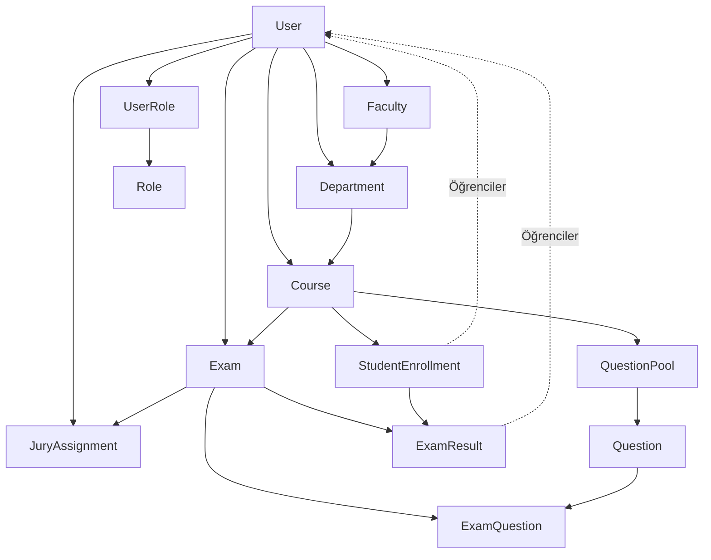

# UViva Sınav Sistemi - Veritabanı Tablo Şeması

## 📊 Genel Bilgiler

- **Sistem**: UViva Exam System
- **Veritabanı**: PostgreSQL
- **Django Sürümü**: 5.2.6
- **Toplam Tablo**: 14 adet (12 ana tablo + 2 rol tablosu)
- **İlişki Türleri**: Foreign Key, Many-to-Many, One-to-One
- **Rol Sistemi**: Yetkili kullanıcılar için çoklu rol desteği (Role + UserRole tabloları). Öğrenciler ayrı rol sistemi dışında tutulur.

## 🗂️ Tablo İlişkileri Şeması



## 📋 Detaylı Tablo Yapıları

### 1. uviva_exam_system_user (Kullanıcı Tablosu)

```sql
uviva_exam_system_user
├── id (BIGINT, PRIMARY KEY, AUTO_INCREMENT)
├── password (VARCHAR(128), NOT NULL)
├── last_login (TIMESTAMP, NULL)
├── is_superuser (BOOLEAN, DEFAULT FALSE)
├── username (VARCHAR(150), UNIQUE, NOT NULL)
├── first_name (VARCHAR(150), NOT NULL)
├── last_name (VARCHAR(150), NOT NULL)
├── email (VARCHAR(254), NOT NULL)
├── is_staff (BOOLEAN, DEFAULT FALSE)
├── is_active (BOOLEAN, DEFAULT TRUE)
├── date_joined (TIMESTAMP, NOT NULL)
├── employee_id (VARCHAR(20), NULL)
├── phone (VARCHAR(15), NULL)
├── department_id (BIGINT, FOREIGN KEY → Department)
└── faculty_id (BIGINT, FOREIGN KEY → Faculty)
```

**Not:** Kullanıcı rolleri `uviva_exam_system_userrole` tablosu üzerinden yönetilir. Öğrenciler için ayrı rol sistemi kullanılmaz.

---

### 2. uviva_exam_system_faculty (Fakülte Tablosu)

```sql
uviva_exam_system_faculty
├── id (BIGINT, PRIMARY KEY, AUTO_INCREMENT)
├── name (VARCHAR(200), NOT NULL)
├── code (VARCHAR(10), UNIQUE, NOT NULL)
├── description (TEXT, NULL)
├── head_id (BIGINT, FOREIGN KEY → User, UNIQUE)
├── created_at (TIMESTAMP, NOT NULL)
└── updated_at (TIMESTAMP, NOT NULL)
```

---

### 3. uviva_exam_system_department (Bölüm Tablosu)

```sql
uviva_exam_system_department
├── id (BIGINT, PRIMARY KEY, AUTO_INCREMENT)
├── name (VARCHAR(200), NOT NULL)
├── code (VARCHAR(10), UNIQUE, NOT NULL)
├── description (TEXT, NULL)
├── faculty_id (BIGINT, FOREIGN KEY → Faculty, NOT NULL)
├── head_id (BIGINT, FOREIGN KEY → User, UNIQUE)
├── created_at (TIMESTAMP, NOT NULL)
└── updated_at (TIMESTAMP, NOT NULL)
```

---

### 4. uviva_exam_system_semester (Dönem Tablosu)

```sql
uviva_exam_system_semester
├── id (BIGINT, PRIMARY KEY, AUTO_INCREMENT)
├── year (INTEGER, NOT NULL)
├── semester_type (VARCHAR(10), NOT NULL)
├── name (VARCHAR(50), NOT NULL)
├── is_active (BOOLEAN, DEFAULT FALSE)
├── start_date (DATE, NOT NULL)
├── end_date (DATE, NOT NULL)
├── created_at (TIMESTAMP, NOT NULL)
└── updated_at (TIMESTAMP, NOT NULL)
```

**Dönem Türleri:** FALL, SPRING, SUMMER

---

### 5. uviva_exam_system_course (Ders Tablosu)

```sql
uviva_exam_system_course
├── id (BIGINT, PRIMARY KEY, AUTO_INCREMENT)
├── code (VARCHAR(20), UNIQUE, NOT NULL)
├── name (VARCHAR(200), NOT NULL)
├── course_type (VARCHAR(20), DEFAULT 'THEORY')
├── credits (INTEGER, NOT NULL)
├── description (TEXT, NULL)
├── department_id (BIGINT, FOREIGN KEY → Department, NOT NULL)
├── semester_id (BIGINT, FOREIGN KEY → Semester, NOT NULL)
├── lecturer_id (BIGINT, FOREIGN KEY → User)
├── created_at (TIMESTAMP, NOT NULL)
└── updated_at (TIMESTAMP, NOT NULL)
```

**Ders Türleri:** THEORY, PRACTICE, SEMINAR, LAB

---

### 6. uviva_exam_system_questionpool (Soru Havuzu Tablosu)

```sql
uviva_exam_system_questionpool
├── id (BIGINT, PRIMARY KEY, AUTO_INCREMENT)
├── name (VARCHAR(200), NOT NULL)
├── description (TEXT, NULL)
├── department_id (BIGINT, FOREIGN KEY → Department, NOT NULL)
├── created_by_id (BIGINT, FOREIGN KEY → User, NOT NULL)
├── created_at (TIMESTAMP, NOT NULL)
└── updated_at (TIMESTAMP, NOT NULL)
```

---

### 7. uviva_exam_system_question (Soru Tablosu)

```sql
uviva_exam_system_question
├── id (BIGINT, PRIMARY KEY, AUTO_INCREMENT)
├── question_text (TEXT, NOT NULL)
├── question_type (VARCHAR(20), DEFAULT 'MULTIPLE_CHOICE')
├── difficulty (VARCHAR(10), DEFAULT 'MEDIUM')
├── options (JSON, NULL)
├── correct_answer (TEXT, NOT NULL)
├── explanation (TEXT, NULL)
├── question_pool_id (BIGINT, FOREIGN KEY → QuestionPool, NOT NULL)
├── course_id (BIGINT, FOREIGN KEY → Course, NOT NULL)
├── created_by_id (BIGINT, FOREIGN KEY → User, NOT NULL)
├── approved_by_id (BIGINT, FOREIGN KEY → User)
├── is_approved (BOOLEAN, DEFAULT FALSE)
├── created_at (TIMESTAMP, NOT NULL)
└── updated_at (TIMESTAMP, NOT NULL)
```

**Soru Türleri:** MULTIPLE_CHOICE, TRUE_FALSE, SHORT_ANSWER, ESSAY
**Zorluk Seviyeleri:** EASY, MEDIUM, HARD

---

### 8. uviva_exam_system_studentenrollment (Öğrenci Kayıt Tablosu)

```sql
uviva_exam_system_studentenrollment
├── id (BIGINT, PRIMARY KEY, AUTO_INCREMENT)
├── student_id (BIGINT, FOREIGN KEY → User, NOT NULL)
├── course_id (BIGINT, FOREIGN KEY → Course, NOT NULL)
└── enrolled_at (TIMESTAMP, NOT NULL)
```

**Unique Constraint:** (student_id, course_id)

---

### 9. uviva_exam_system_exam (Sınav Tablosu)

```sql
uviva_exam_system_exam
├── id (BIGINT, PRIMARY KEY, AUTO_INCREMENT)
├── title (VARCHAR(200), NOT NULL)
├── exam_type (VARCHAR(20), DEFAULT 'MIDTERM')
├── description (TEXT, NULL)
├── scheduled_date (TIMESTAMP, NOT NULL)
├── duration_minutes (INTEGER, NOT NULL)
├── course_id (BIGINT, FOREIGN KEY → Course, NOT NULL)
├── created_by_id (BIGINT, FOREIGN KEY → User, NOT NULL)
├── is_active (BOOLEAN, DEFAULT TRUE)
├── created_at (TIMESTAMP, NOT NULL)
└── updated_at (TIMESTAMP, NOT NULL)
```

**Sınav Türleri:** MIDTERM, FINAL, QUIZ, PROJECT, ORAL

---

### 10. uviva_exam_system_examquestion (Sınav Soru Tablosu)

```sql
uviva_exam_system_examquestion
├── id (BIGINT, PRIMARY KEY, AUTO_INCREMENT)
├── exam_id (BIGINT, FOREIGN KEY → Exam, NOT NULL)
├── question_id (BIGINT, FOREIGN KEY → Question, NOT NULL)
├── order (INTEGER, NOT NULL)
└── points (DECIMAL(5,2), DEFAULT 1.0)
```

**Unique Constraint:** (exam_id, question_id)

---

### 11. uviva_exam_system_examresult (Sınav Sonuç Tablosu)

```sql
uviva_exam_system_examresult
├── id (BIGINT, PRIMARY KEY, AUTO_INCREMENT)
├── student_id (BIGINT, FOREIGN KEY → User, NOT NULL)
├── exam_id (BIGINT, FOREIGN KEY → Exam, NOT NULL)
├── score (DECIMAL(5,2), NULL)
├── max_score (DECIMAL(5,2), NOT NULL)
├── jury_comments (TEXT, NULL)
├── passed (BOOLEAN, DEFAULT FALSE)
├── started_at (TIMESTAMP, NULL)
├── completed_at (TIMESTAMP, NULL)
├── answers (JSON, NULL)
├── created_at (TIMESTAMP, NOT NULL)
└── updated_at (TIMESTAMP, NOT NULL)
```

**Unique Constraint:** (student_id, exam_id)

---

### 12. uviva_exam_system_juryassignment (Jüri Atama Tablosu)

```sql
uviva_exam_system_juryassignment
├── id (BIGINT, PRIMARY KEY, AUTO_INCREMENT)
├── exam_id (BIGINT, FOREIGN KEY → Exam, NOT NULL)
├── jury_member_id (BIGINT, FOREIGN KEY → User, NOT NULL)
├── role (VARCHAR(50), DEFAULT 'Jüri Üyesi')
└── assigned_at (TIMESTAMP, NOT NULL)
```

**Unique Constraint:** (exam_id, jury_member_id)

---

### 13. uviva_exam_system_role (Rol Tablosu)

```sql
uviva_exam_system_role
├── id (BIGINT, PRIMARY KEY, AUTO_INCREMENT)
├── name (VARCHAR(100), NOT NULL)
├── code (VARCHAR(50), UNIQUE, NOT NULL)
├── description (TEXT, NULL)
├── hierarchy_level (INTEGER, DEFAULT 1)
├── is_active (BOOLEAN, DEFAULT TRUE)
├── created_at (TIMESTAMP, NOT NULL)
└── updated_at (TIMESTAMP, NOT NULL)
```

**Rol Kodları:** BOSS, FACULTY_HEAD, DEPARTMENT_HEAD, LECTURER

**Sistem Rolleri (Öğrenciler Hariç):**
- BOSS (10): Süper Admin - Sistem yöneticisi
- FACULTY_HEAD (8): Fakülte Sorumlusu - Fakülte yönetimi
- DEPARTMENT_HEAD (6): Kurul Başkanı - Bölüm yönetimi
- LECTURER (4): Hoca/Jüri - Öğretim üyesi

**Not:** Öğrenciler ayrı rol olarak değil, sadece kayıt sistemi için kullanılır.

---

### 14. uviva_exam_system_userrole (Kullanıcı-Rol İlişki Tablosu)

```sql
uviva_exam_system_userrole
├── id (BIGINT, PRIMARY KEY, AUTO_INCREMENT)
├── user_id (BIGINT, FOREIGN KEY → User, NOT NULL)
├── role_id (BIGINT, FOREIGN KEY → Role, NOT NULL)
├── assigned_by_id (BIGINT, FOREIGN KEY → User)
├── assigned_at (TIMESTAMP, NOT NULL)
├── expires_at (TIMESTAMP, NULL)
├── is_primary (BOOLEAN, DEFAULT FALSE)
└── is_active (BOOLEAN, DEFAULT TRUE)
```

**Unique Constraint:** (user_id, role_id)

---

## 🔗 İlişki Açıklamaları

### Foreign Key İlişkileri:
1. **User → UserRole**: Kullanıcının yetkili rolleri (One-to-Many)
2. **Role → UserRole**: Role sahip kullanıcılar (One-to-Many)
3. **User → Faculty**: Fakülte sorumlusu (One-to-One)
4. **User → Department**: Bölüm başkanı (One-to-One)
5. **Faculty → Department**: Fakülte altındaki bölümler
6. **Department → Course**: Bölüm altındaki dersler
7. **Department → QuestionPool**: Bölüm altındaki soru havuzları
8. **Semester → Course**: Dönem altındaki dersler
9. **Course → StudentEnrollment**: Derse kayıtlı öğrenciler
10. **Course → Exam**: Ders altındaki sınavlar
11. **QuestionPool → Question**: Havuz altındaki sorular
12. **Exam → ExamQuestion**: Sınavdaki sorular
13. **Exam → ExamResult**: Sınav sonuçları
14. **Exam → JuryAssignment**: Sınav jürisi

### Many-to-Many İlişkileri:
- **Exam ↔ Question**: `ExamQuestion` ara tablosu ile
- **Exam ↔ User (Jury)**: `JuryAssignment` ara tablosu ile
- **User ↔ Course (Students)**: `StudentEnrollment` ara tablosu ile

### Unique Kısıtlamaları:
- `uviva_exam_system_user.username`
- `uviva_exam_system_user.email`
- `uviva_exam_system_role.code`
- `uviva_exam_system_faculty.code`
- `uviva_exam_system_department.code`
- `uviva_exam_system_semester(year, semester_type)`
- `uviva_exam_system_course.code`
- `uviva_exam_system_studentenrollment(student_id, course_id)`
- `uviva_exam_system_examquestion(exam_id, question_id)`
- `uviva_exam_system_examresult(student_id, exam_id)`
- `uviva_exam_system_juryassignment(exam_id, jury_member_id)`
- `uviva_exam_system_userrole(user_id, role_id)`

Bu şema UViva Sınav Sistemi'nin tüm veritabanı yapısını kapsamaktadır. Her tablonun detaylı yapısı, ilişkileri ve kısıtlamaları belirtilmiştir.

## 🎯 **Çoklu Rol Sistemi Özellikleri:**
- **Role Tablosu**: Sistemdeki yetkili rollerin merkezi yönetimi (BOSS, FACULTY_HEAD, DEPARTMENT_HEAD, LECTURER)
- **UserRole Tablosu**: Yetkili kullanıcıların birden fazla rolü olabilir
- **Rol Hiyerarşisi**: hierarchy_level ile rol önceliklendirmesi (4-10 arası)
- **Rol Geçerlilik Süresi**: expires_at ile zaman sınırlı roller
- **Ana Rol**: is_primary ile kullanıcının temel rolü belirleme
- **Rol Atama Geçmişi**: assigned_by ve assigned_at ile takip

**Not:** Öğrenciler rol tabanlı yetkilendirme sistemi dışında tutulur, sadece kayıt ve sınav sistemi için kullanılır.
